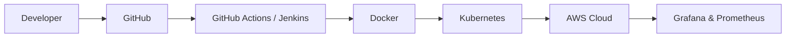

<h1 align="center">Hi 👋, I'm Yashwanth S V</h1>
<h3 align="center">Aspiring DevOps Engineer | AWS Cloud | Kubernetes | CI/CD Automation</h3>

<p align="center">
  
</p>

<p align="center">
  
</p>

---

# 🚀 About Me

```yaml
Name: Yashwanth S V
Role: Aspiring DevOps Engineer

Focus:
  - AWS Cloud Infrastructure
  - CI/CD Automation
  - Kubernetes Orchestration
  - Infrastructure as Code
  - Cloud Native Technologies

Currently Learning:
  - Advanced Kubernetes
  - GitOps
  - DevSecOps
```

- ☁️ Passionate about Cloud & DevOps Engineering
- 🔧 Building scalable CI/CD automation pipelines
- 🐳 Working with Docker & Kubernetes
- 🏗️ Automating infrastructure using Terraform
- 📊 Monitoring systems with Grafana & Prometheus
- 🚀 Interested in scalable cloud-native architectures

---

# 🛠️ Tech Stack

<p align="center">


</p>

---

# ⚙️ DevOps Workflow



---

# 🚀 Featured Projects

<table>
<tr>

<td width="50%">

## 🔹 Kubernetes CI/CD Pipeline

### Features
- Multi-environment deployments
- GitHub Actions automation
- Docker containerization
- Kubernetes namespace isolation
- AWS EC2 + K3s cluster

### Stack
`Kubernetes` `Docker` `GitHub Actions` `AWS`

</td>

<td width="50%">

## 🔹 Terraform Infrastructure Automation

### Features
- Automated VPC provisioning
- EC2 + ALB setup
- Infrastructure as Code
- Scalable AWS environments
- Secure configuration management

### Stack
`Terraform` `AWS` `IaC`

</td>

</tr>
</table>

---

<table>
<tr>

<td width="50%">

## 🔹 Jenkins CI/CD Deployment

### Features
- Automated build & deployment
- Continuous integration workflows
- Docker image automation
- AWS deployment orchestration

### Stack
`Jenkins` `Docker` `AWS`

</td>

<td width="50%">

## 🌌 Current Focus

```bash
Learning:
┣━━ GitOps
┣━━ Helm
┣━━ ArgoCD
┣━━ DevSecOps
┗━━ Cloud Native Tools
```

</td>

</tr>
</table>

---

# 🏆 Certifications

<p align="left">

✅ AWS Cloud Engineer Trainee  
✅ Deloitte Cyber Job Simulation  
✅ Python Internship Certification  

</p>

---

# 🌐 Connect With Me

<p align="center">

<a href="https://www.linkedin.com/in/yashwanthsv-lin3/">
  
</a>

<a href="mailto:yash03.inbox@gmail.com">
  
</a>

<a href="https://github.com/YashSV-Cloud">
  
</a>

</p>

---

# 💻 DevOps Philosophy

```yaml
✔ Automate Everything
✔ Build Reliable Systems
✔ Monitor Continuously
✔ Scale Efficiently
✔ Learn Constantly
```

---

# ⚡ Terminal Mode

```bash
yashwanth@devops:~$ kubectl get pods

NAME                          STATUS    READY
ci-cd-pipeline                Running   1/1
terraform-automation          Running   1/1
monitoring-stack              Running   1/1
cloud-infrastructure          Running   1/1

System Status: Healthy ✅
```

---

<p align="center">
  
</p>
