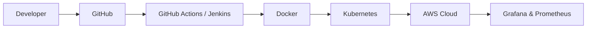

<h1 align="center">Hi 👋, I'm Yashwanth S V</h1>
<h3 align="center">Aspiring DevOps Engineer | AWS Cloud | Kubernetes | CI/CD Automation</h3>

<p align="center">
  
</p>

<p align="center">
  
</p>

---

# 🚀 About Me

```yaml
Name: Yashwanth S V
Role: Aspiring DevOps Engineer
Focus:
  - Cloud Infrastructure
  - CI/CD Automation
  - Kubernetes Orchestration
  - Infrastructure as Code
Learning:
  - Advanced Kubernetes
  - GitOps
  - Cloud Native Tools
```

- ☁️ Passionate about AWS Cloud & DevOps Engineering
- 🔧 Experienced in CI/CD Pipeline Automation
- 🐳 Working with Docker & Kubernetes
- 🏗️ Building scalable infrastructure using Terraform
- 📊 Monitoring systems using Prometheus & Grafana
- 🌱 Exploring Cloud Native & DevOps Best Practices

---

# 🛠️ Tech Stack

<p align="center">


</p>

---

# ⚙️ DevOps Workflow



---

# 📊 GitHub Statistics

<p align="center">


</p>

<p align="center">


</p>

---

# 🏗️ Featured Projects

## 🔹 Multi-Environment CI/CD Pipeline

🚀 Kubernetes namespace isolation  
🚀 GitHub Actions automation  
🚀 Dockerized deployments  
🚀 K3s Cluster on AWS EC2  
🚀 Secure secrets management  

### Tech Used
`Kubernetes` `Docker` `GitHub Actions` `AWS`

---

## 🔹 Automated CI/CD Pipeline for Web Application

⚡ End-to-end Jenkins pipeline  
⚡ Continuous deployment workflows  
⚡ Docker containerization  
⚡ AWS deployment automation  

### Tech Used
`Jenkins` `Docker` `AWS`

---

## 🔹 Terraform Infrastructure Automation

☁️ AWS Infrastructure Provisioning  
☁️ VPC + EC2 + Load Balancer Setup  
☁️ Infrastructure as Code  
☁️ Scalable cloud environments  

### Tech Used
`Terraform` `AWS` `IaC`

---

# 🏆 Certifications

<p align="left">

✅ AWS Cloud Engineer Trainee  
✅ Deloitte Cyber Job Simulation  
✅ Python Internship Certification  

</p>

---

# 📈 Contribution Graph

<p align="center">

[](https://github.com/YashSV-Cloud)

</p>

---

# 🏅 GitHub Trophies

<p align="center">


</p>

---

# 🌐 Connect With Me

<p align="center">

<a href="https://www.linkedin.com/in/yashwanthsv-lin3/">
  
</a>

<a href="mailto:yash03.inbox@gmail.com">
  
</a>

<a href="https://github.com/YashSV-Cloud">
  
</a>

</p>

---

# 💻 DevOps Philosophy

```yaml
✔ Automate Everything
✔ Monitor Continuously
✔ Deploy Reliably
✔ Scale Efficiently
✔ Learn Constantly
```

---

# ⚡ Fun Fact

```bash
while(true){
  learn();
  build();
  automate();
  improve();
}
```

---

<p align="center">
  
</p>
